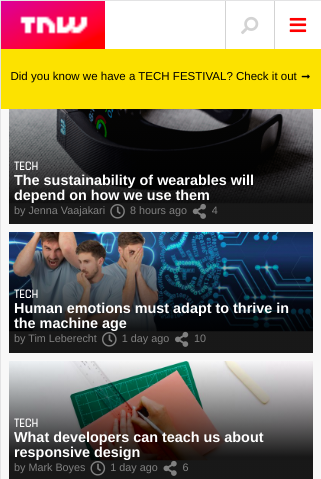
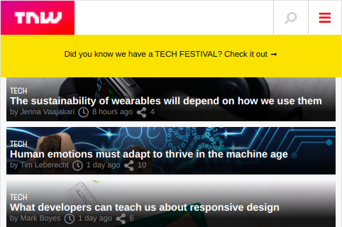
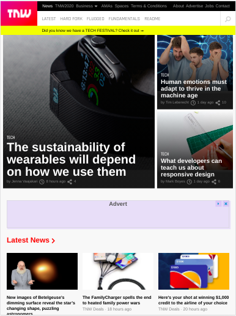
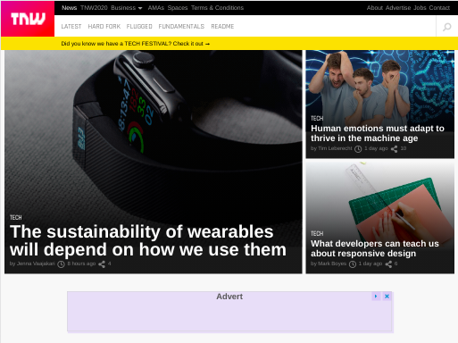

# Responsive-Design-The-Next-Web-Solo
Cloning The Next Web, a tech-focused magazine which uses media queries to gracefully degrade their site as the window size is reduced

[Live Demo](https://romantic-hopper-214a74.netlify.com/)

### Extra small view (min-width:320px and max-width:480px)

#### Portriat

#### Landscape

### Medium view (min-width:768px and max-width:1024px)

#### Portriat

#### Landscape

## Built With

- HTML,
- CSS

## Author

- Github: [@mupa1](https://github.com/Mupa1)
- Twitter: [@mupa_mmbetsa](https://twitter.com/mupa_mmbetsa)
- Linkedin: [mupa-mmbetsa](https://www.linkedin.com/in/mupa-mmbetsa)

## 🤝 Contributing

Contributions, issues and feature requests are welcome!

Feel free to check the [issues page](https://github.com/Mupa1/Responsive-Design-The-Next-Web-Solo/issues)

## Show your support

Give a ⭐️ if you like this project!

## 📝 License

This project is [MIT](lic.url) licensed.
